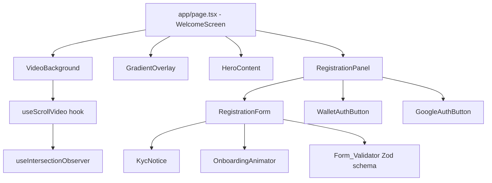

# Design Document — Welcome Screen

## Overview

La Welcome Screen es la página pública de entrada de Cronium, ubicada en la ruta `/`. Reemplaza el `app/page.tsx` actual y sirve como punto de conversión principal: visitante → usuario registrado → flujo KYC → compra de activos tokenizados.

### Objetivo de diseño

Crear una experiencia visual premium al estilo "Netflix landing" con:
- Fondo de video de ciudad (NYC) sincronizado con el scroll del usuario
- Panel de registro/login glassmorphic con doble autenticación (email + Web3 wallet o Google)
- Layout de dos columnas en desktop (video full-screen + panel de registro a la derecha)
- Layout de una columna en mobile (panel superpuesto sobre el video)
- Animaciones Framer Motion para el onboarding inicial

### Stack técnico confirmado

| Tecnología | Versión | Rol |
|---|---|---|
| Next.js | 16.1.6 | App Router, SSR/SSG, `<Image>` |
| TypeScript | ^5 | Tipado estático |
| Tailwind CSS | ^4 | Utility-first styles |
| Framer Motion | ^12.30.0 | Animaciones declarativas |
| Zod | ^4.3.6 | Validación de esquemas |
| wagmi + RainbowKit | ^2.x | Web3 wallet connections |
| NextAuth.js v5 (Auth.js) | a instalar | Google OAuth 2.0 |

> **NextAuth.js v5 (Auth.js)**: Es la versión estable más reciente y la recomendada para Next.js 14+ App Router. Se integra mediante Route Handlers (`app/api/auth/[...nextauth]/route.ts`) y no requiere cambios en `providers.tsx` ni en la configuración wagmi existente.

---

## Architecture

### Flujo de autenticación dual

```
Visitante llega a /
        │
        ▼
  Welcome Screen (app/page.tsx reemplazado)
        │
   ┌────┴────┐
   │         │
   ▼         ▼
Email/Pass   Wallet Web3 / Google
(NextAuth)   (RainbowKit / NextAuth Google)
   │         │
   └────┬────┘
        │
        ▼
  Plataforma interna (dashboard existente)
  → KYC → Compra de tokens
```

### Layering del viewport

```
z-0  │ <video> VideoBackground (100vw × 100vh, object-fit: cover)
z-10 │ GradientOverlay (position: absolute, gradientes CSS)
z-20 │ HeroContent (texto izquierdo — solo desktop)
z-30 │ RegistrationPanel (glassmorphic card — derecha desktop / centro mobile)
z-40 │ AuthModal (modales RainbowKit / Google OAuth)
```

### Diagrama de componentes



---

## Components and Interfaces

### 1. `VideoBackground`

**Responsabilidad**: Renderizar el elemento `<video>` de pantalla completa con las fuentes WebM/MP4 y gestionar la reproducción en función de `prefers-reduced-motion`.

```typescript
interface VideoBackgroundProps {
  /** URL del video en formato WebM/VP9 (fuente primaria) */
  webmSrc: string;
  /** URL del video en formato MP4/H.264 (fallback) */
  mp4Src: string;
  /** URL de la imagen poster (frame estático inicial) */
  posterSrc: string;
  /** Ref forwarded al elemento <video> para control de currentTime */
  videoRef: React.RefObject<HTMLVideoElement>;
  /** Clase CSS adicional (optional) */
  className?: string;
}
```

**Comportamiento**:
- Si `window.matchMedia('(prefers-reduced-motion: reduce)').matches === true`: oculta `<video>`, muestra `<Image>` poster con `priority`
- Atributos siempre presentes: `autoPlay muted loop playsInline preload="none"`
- Primer `<source>` con `type="video/webm"`, segundo con `type="video/mp4"`
- `will-change: transform` aplicado al contenedor wrapper (no al `<video>` directamente)

---

### 2. `useScrollVideo` (custom hook)

**Responsabilidad**: Vincular la posición de scroll del usuario con el `currentTime` del video, usando `requestAnimationFrame` para suavidad de 60fps y `IntersectionObserver` para pausar cuando la sección hero está fuera del viewport.

```typescript
interface UseScrollVideoOptions {
  /** Ref al elemento <video> a controlar */
  videoRef: React.RefObject<HTMLVideoElement>;
  /** Ref al contenedor de la sección hero (para calcular el rango de scroll) */
  sectionRef: React.RefObject<HTMLElement>;
  /** Factor de interpolación lineal para suavizado (0 < alpha <= 1, default: 0.08) */
  lerpAlpha?: number;
}

interface UseScrollVideoReturn {
  /** Progreso normalizado del scroll [0, 1] */
  scrollProgress: number;
  /** true cuando el hero está visible en viewport */
  isVisible: boolean;
}

function useScrollVideo(options: UseScrollVideoOptions): UseScrollVideoReturn
```

**Algoritmo interno**:
```
onScroll():
  rawProgress = clamp((scrollY - sectionTop) / sectionHeight, 0, 1)
  targetTime = rawProgress * video.duration

rAF loop:
  currentTarget = targetTime
  video.currentTime = lerp(video.currentTime, currentTarget, lerpAlpha)
  // lerp(a, b, α) = a + (b - a) * α
```

**Integración con IntersectionObserver**:
- Observa `sectionRef.current`
- Si `isIntersecting === false`: cancela el loop rAF
- Si `isIntersecting === true`: reinicia el loop rAF

---

### 3. `GradientOverlay`

**Responsabilidad**: Capa CSS pura que garantiza legibilidad del contenido sobre el video.

```typescript
// Componente sin props — puramente presentacional
function GradientOverlay(): JSX.Element
```

**CSS aplicado** (Tailwind con values arbitrarios):
```css
/* Degradado vertical (Netflix-style) */
background: linear-gradient(
  to bottom,
  transparent 0%,
  rgba(15, 17, 23, 0.4) 40%,
  rgba(0, 0, 0, 0.85) 100%
);

/* Degradado horizontal sutil */
+ linear-gradient(
  to right,
  rgba(15, 17, 23, 0.4) 0%,
  transparent 25%,
  transparent 75%,
  rgba(15, 17, 23, 0.4) 100%
)
```

---

### 4. `HeroContent`

**Responsabilidad**: Bloque de copy de marketing ubicado en la mitad izquierda del layout desktop. Oculto en mobile (el panel de registro ocupa toda la pantalla).

```typescript
interface HeroContentProps {
  /** Progreso de scroll [0,1] para animar la opacidad del texto */
  scrollProgress: number;
}
```

Contiene: headline, subheadline, lista de features con iconos, y una badge "Powered by Base Network".

---

### 5. `RegistrationPanel`

**Responsabilidad**: Panel glassmorphic de la derecha (desktop) / centrado (mobile) que contiene el módulo de autenticación dual.

```typescript
interface RegistrationPanelProps {
  /** Modo activo: registro con email o login */
  mode: 'register' | 'login';
  onModeChange: (mode: 'register' | 'login') => void;
}
```

**Estructura visual**:
- Tab selector: "Crear cuenta" | "Iniciar sesión"
- `RegistrationForm` (email/password)
- Divider "o continúa con"
- `WalletAuthButton` (abre RainbowKit ConnectModal)
- `GoogleAuthButton` (dispara NextAuth signIn)
- `KycNotice` (solo en modo 'register')

---

### 6. `RegistrationForm`

**Responsabilidad**: Formulario controlado con react-hook-form + Zod para registro por email.

```typescript
interface RegistrationFormProps {
  onSuccess: (user: { email: string; name: string }) => void;
  onSwitchToLogin: () => void;
}

// Datos del formulario de registro
interface RegistrationFormData {
  fullName: string;        // máx 120 chars, sanitizado
  email: string;           // máx 254 chars, RFC 5321
  password: string;        // mín 8 chars, 1 mayúscula, 1 minúscula, 1 especial
  confirmPassword: string; // debe ser === password
}
```

**Campos y atributos HTML**:
| Campo | type | autocomplete | Validación |
|---|---|---|---|
| `fullName` | text | name | required, máx 120 |
| `email` | email | email | RFC 5321, máx 254 |
| `password` | password | new-password | mín 8, 1 upper, 1 lower, 1 special |
| `confirmPassword` | password | new-password | === password |

---

### 7. `KycNotice`

**Responsabilidad**: Banner informativo dentro del formulario de registro que alerta sobre el requisito KYC.

```typescript
// Componente sin props — contenido estático
function KycNotice(): JSX.Element
```

Estilos: glassmorphic badge con fondo `rgba(0, 0, 245, 0.08)`, borde `rgba(0, 0, 245, 0.3)`, ícono de shield, texto "Necesitarás verificar tu identidad (KYC) para adquirir tokens".

---

### 8. `OnboardingAnimator`

**Responsabilidad**: Wrapper que controla la secuencia de animación de entrada del formulario (solo se activa una vez por sesión).

```typescript
interface OnboardingAnimatorProps {
  children: React.ReactNode;
  /** Si true, salta animaciones (prefers-reduced-motion) */
  reducedMotion: boolean;
}
```

**Lógica de sesión**: Usa `sessionStorage.getItem('onboarding-animated')` para recordar si ya se ejecutó. Al activarse, persiste la clave.

**Variantes Framer Motion**:
```typescript
const containerVariants = {
  hidden: {},
  visible: { transition: { staggerChildren: 0.08 } }
}

const itemVariants = {
  hidden: { opacity: 0, y: 20 },
  visible: { opacity: 1, y: 0, transition: { duration: 0.3, ease: 'easeOut' } }
}

const kycVariants = {
  hidden: { scaleY: 0, opacity: 0, originY: 0 },
  visible: { scaleY: 1, opacity: 1, transition: { duration: 0.4, ease: 'easeOut', delay: 0.4 } }
}
```

---

### 9. `WalletAuthButton`

**Responsabilidad**: Botón que abre el modal de RainbowKit para conectar wallet. Reutiliza la configuración existente de `providers.tsx`.

```typescript
interface WalletAuthButtonProps {
  onConnected?: (address: string) => void;
}
```

Internamente usa `useConnectModal` de `@rainbow-me/rainbowkit` en lugar de renderizar el `ConnectButton` completo, para mantener el diseño visual de Nova.

---

### 10. `GoogleAuthButton`

**Responsabilidad**: Botón que dispara el flujo OAuth 2.0 con Google a través de NextAuth.js v5.

```typescript
interface GoogleAuthButtonProps {
  onSuccess?: () => void;
}
```

Llama a `signIn('google', { callbackUrl: '/dashboard' })` de `next-auth/react`.

---

## Data Models

### Esquema Zod de Registro (`schemas/registration.ts`)

```typescript
import { z } from 'zod'

// Regex para caracteres de control (U+0000–U+001F, excluyendo U+0020 espacio)
const CONTROL_CHARS = /[\u0000-\u001F]/g

const sanitize = (s: string) => s.replace(CONTROL_CHARS, '')

export const registrationSchema = z
  .object({
    fullName: z
      .string()
      .transform(sanitize)
      .pipe(z.string().min(1, 'El nombre es requerido').max(120, 'Máximo 120 caracteres')),

    email: z
      .string()
      .transform(sanitize)
      .pipe(
        z.string()
          .email('Ingresa un email válido')
          .max(254, 'Email demasiado largo (máx. 254 caracteres)')
      ),

    password: z
      .string()
      .min(8, 'Mínimo 8 caracteres')
      .regex(/[A-Z]/, 'Debe contener al menos una mayúscula')
      .regex(/[a-z]/, 'Debe contener al menos una minúscula')
      .regex(/[^A-Za-z0-9]/, 'Debe contener al menos un carácter especial'),

    confirmPassword: z.string(),
  })
  .refine((data) => data.password === data.confirmPassword, {
    message: 'Las contraseñas no coinciden',
    path: ['confirmPassword'],
  })

export type RegistrationFormData = z.infer<typeof registrationSchema>

export const loginSchema = z.object({
  email: z.string().email('Email inválido').max(254),
  password: z.string().min(1, 'La contraseña es requerida'),
})

export type LoginFormData = z.infer<typeof loginSchema>
```

---

### Estructura de archivos propuesta

```
frontend/
├── app/
│   ├── page.tsx                          ← WelcomeScreen (reemplaza el actual)
│   ├── welcome/
│   │   ├── components/
│   │   │   ├── VideoBackground.tsx
│   │   │   ├── GradientOverlay.tsx
│   │   │   ├── HeroContent.tsx
│   │   │   ├── RegistrationPanel.tsx
│   │   │   ├── RegistrationForm.tsx
│   │   │   ├── KycNotice.tsx
│   │   │   ├── OnboardingAnimator.tsx
│   │   │   ├── WalletAuthButton.tsx
│   │   │   └── GoogleAuthButton.tsx
│   │   ├── hooks/
│   │   │   └── useScrollVideo.ts
│   │   └── schemas/
│   │       └── registration.ts
│   └── api/
│       └── auth/
│           └── [...nextauth]/
│               └── route.ts             ← NextAuth.js v5 handler
├── auth.ts                              ← NextAuth.js v5 config (next-auth)
└── middleware.ts                        ← Protección de rutas autenticadas
```

### NextAuth.js v5 — Configuración de Google Provider

```typescript
// auth.ts (raíz del proyecto frontend)
import NextAuth from 'next-auth'
import Google from 'next-auth/providers/google'

export const { handlers, auth, signIn, signOut } = NextAuth({
  providers: [
    Google({
      clientId: process.env.GOOGLE_CLIENT_ID!,
      clientSecret: process.env.GOOGLE_CLIENT_SECRET!,
    }),
  ],
  callbacks: {
    async session({ session, token }) {
      // Exponer el sub (Google ID) en la sesión
      if (session.user && token.sub) {
        session.user.id = token.sub
      }
      return session
    },
  },
  pages: {
    signIn: '/',       // Redirige al welcome screen si no autenticado
    newUser: '/dashboard', // Redirige a dashboard tras registro exitoso
  },
})
```

**Variables de entorno requeridas**:
```env
NEXTAUTH_SECRET=<random_secret_min_32_chars>
NEXTAUTH_URL=http://localhost:3000
GOOGLE_CLIENT_ID=<oauth_client_id>
GOOGLE_CLIENT_SECRET=<oauth_client_secret>
```

---

### Modelo de sesión unificada

Tanto la autenticación por email (credentials) como por Google y por wallet deben resultar en un estado de usuario accesible. Se usa un store Zustand (`useAuthStore`) que consolida:

```typescript
interface AuthState {
  // Email/Google auth (NextAuth)
  session: Session | null;
  // Web3 wallet auth (wagmi)
  walletAddress: `0x${string}` | undefined;
  // Estado unificado
  isAuthenticated: boolean;
}
```

---

## Correctness Properties

*Una propiedad es una característica o comportamiento que debe mantenerse verdadero en todas las ejecuciones válidas de un sistema — esencialmente, una afirmación formal sobre lo que el sistema debe hacer. Las propiedades sirven como puente entre las especificaciones legibles por humanos y las garantías de corrección verificables por máquina.*

Las siguientes propiedades se identificaron a partir del análisis de criterios de aceptación. Se excluyen los criterios de infraestructura (CSS estático, configuración HTML, checks de rendimiento de red) que son mejor cubiertos por tests de ejemplo o auditorías de performance.

---

### Property 1: Mapeo de scroll a currentTime

*Para cualquier* posición de scroll normalizada `p ∈ [0, 1]` y cualquier duración de video `d > 0`, la función `scrollToTime(p, d)` debe retornar un valor en el rango `[0, d]` tal que `scrollToTime(p, d) === p * d`.

**Validates: Requirements 2.1, 2.2, 2.3**

---

### Property 2: Invariante de lerp

*Para cualquier* par de valores `current` y `target` y cualquier factor de interpolación `α ∈ (0, 1)`, la función `lerp(current, target, α)` debe retornar un valor estrictamente entre `current` y `target` (cuando `current !== target`), convergiendo hacia `target` en cada aplicación sucesiva.

**Validates: Requirements 2.4**

---

### Property 3: Validación de email — aceptación universal

*Para cualquier* string que tenga formato de email RFC válido (usuario@dominio.tld), el esquema Zod `registrationSchema` debe aceptarlo en el campo `email` sin producir errores de validación en ese campo.

**Validates: Requirements 4.3**

---

### Property 4: Validación de contraseña — rechazo de strings inválidos

*Para cualquier* string que viole al menos una de las reglas de contraseña (longitud < 8, sin mayúscula, sin minúscula, sin carácter especial), el esquema Zod debe rechazarlo con un mensaje de error descriptivo para el campo `password`.

**Validates: Requirements 4.4**

---

### Property 5: Igualdad de contraseñas

*Para cualquier* par de strings `(p1, p2)`, la validación del esquema debe pasar para `confirmPassword` si y solo si `p1 === p2`, cuando ambos strings satisfacen individualmente las reglas de contraseña.

**Validates: Requirements 4.5**

---

### Property 6: Idempotencia de envío de formulario

*Para cualquier* número N ≥ 2 de intentos de envío del formulario mientras la solicitud anterior está en vuelo (estado loading), el handler de submit debe invocar la función de API exactamente una vez, ignorando los N-1 clics adicionales.

**Validates: Requirements 4.8**

---

### Property 7: Idempotencia de la animación de onboarding

*Para cualquier* número N ≥ 1 de eventos de focus sobre el primer campo del formulario dentro de la misma sesión, la secuencia de animación de entrada debe ejecutarse exactamente una vez (el estado `animated` en sessionStorage se escribe una sola vez).

**Validates: Requirements 5.4**

---

### Property 8: Sanitización de caracteres de control

*Para cualquier* string de entrada en los campos de texto del formulario, el resultado de la función `sanitize(input)` no debe contener ningún carácter con code point < U+0020 (excluyendo el espacio U+0020 que es aceptable).

**Validates: Requirements 8.1**

---

### Property 9: Invariante de truncado

*Para cualquier* string `s`: si `s.length > limit` entonces `truncate(s, limit).length === limit`; si `s.length <= limit` entonces `truncate(s, limit) === s`. Este invariante debe cumplirse para `fullName` (limit=120) y `email` (limit=254).

**Validates: Requirements 8.2**

---

### Property 10: Área táctil mínima

*Para cualquier* elemento interactivo (botón, input) renderizado en el `RegistrationPanel`, sus dimensiones de área táctil deben ser ≥ 44×44px, garantizando accesibilidad en dispositivos móviles.

**Validates: Requirements 7.5**

---

**Reflexión de propiedades — eliminación de redundancias**:

- Properties 3 y 4 son complementarias (aceptación y rechazo), no redundantes.
- Properties 1 y 2 cubren aspectos distintos del scroll controller (mapping vs. interpolation).
- Properties 8 y 9 cubren operaciones distintas de la misma función de sanitización (eliminación vs. truncado).
- Property 5 combina las dos direcciones de 4.5 (p1===p2 y p1≠p2) en una sola propiedad.
- Properties 6 y 7 son ambas propiedades de idempotencia pero sobre subsistemas distintos (API call vs. animación).

No se detectaron propiedades redundantes. Todas las 10 propiedades permanecen.

---

## Error Handling

### Errores de red / autenticación

| Escenario | Respuesta UX |
|---|---|
| Google OAuth falla / timeout | Toast error: "No se pudo conectar con Google. Intenta de nuevo." — botón recupera estado normal |
| Wallet connection rechazada por usuario | Modal se cierra silenciosamente — no se muestra error (el usuario canceló deliberadamente) |
| Wallet en red incorrecta | Badge "Red no soportada" visible sobre el botón, con CTA para cambiar de red |
| Registro por email — email ya existente | Error inline en campo email: "Este email ya está registrado. ¿Quieres iniciar sesión?" con link |
| Registro por email — error 500 | Toast genérico: "Error del servidor. Por favor intenta en unos minutos." |
| Registro por email — sin conexión | Toast: "Sin conexión. Verifica tu red e intenta de nuevo." |

### Errores del video

| Escenario | Respuesta UX |
|---|---|
| Video no carga (error de red) | `onError` del `<video>` activa fallback: imagen poster de alta resolución ocupa el fondo |
| Formato no soportado | El fallback MP4 es intentado automáticamente por el navegador via el segundo `<source>` |
| API `play()` rechazada (autoplay policy) | El video queda en pausa sobre el poster; el scroll controller sigue funcionando cuando el usuario interactúa |

### Validación de formulario

- Errores se muestran inline debajo del campo en `< 100ms` tras el submit (validación síncrona Zod)
- Los mensajes usan rojo `#DC2626` (design system `error`) con ícono de alerta
- El foco se mueve automáticamente al primer campo con error para accesibilidad

---

## Testing Strategy

### Herramienta de PBT

**fast-check** (`npm install --save-dev fast-check`) — la librería de property-based testing más madura del ecosistema TypeScript/JavaScript.

> Justificación: Se integra nativamente con Vitest (ya instalado en el proyecto), tiene excelente soporte para TypeScript, y genera shrinking automático de ejemplos fallidos.

### Dual Testing Approach

#### Tests de propiedades (Vitest + fast-check) — mínimo 100 iteraciones

Cada test de propiedad referencia la propiedad del diseño mediante un comentario en el código:

```typescript
// Feature: welcome-screen, Property 1: scroll-to-time mapping
it.prop([fc.float({ min: 0, max: 1 }), fc.float({ min: 0.1, max: 300 })])(
  'scrollToTime(p, d) === p * d for all valid p and d',
  (p, d) => {
    expect(scrollToTime(p, d)).toBeCloseTo(p * d, 5)
  }
)
```

**Tags por propiedad**:
- `Feature: welcome-screen, Property 1: scroll-to-time mapping`
- `Feature: welcome-screen, Property 2: lerp interpolation invariant`
- `Feature: welcome-screen, Property 3: email validation acceptance`
- `Feature: welcome-screen, Property 4: password validation rejection`
- `Feature: welcome-screen, Property 5: password equality`
- `Feature: welcome-screen, Property 6: form submission idempotence`
- `Feature: welcome-screen, Property 7: onboarding animation idempotence`
- `Feature: welcome-screen, Property 8: control character sanitization`
- `Feature: welcome-screen, Property 9: field truncation invariant`
- `Feature: welcome-screen, Property 10: touch target minimum size`

#### Tests de ejemplo (Vitest + Testing Library)

Los tests de ejemplo cubren:
- Renderizado correcto de atributos HTML del video (`autoplay`, `muted`, `loop`, `playsInline`, `preload="none"`)
- Comportamiento con `prefers-reduced-motion: reduce` (poster visible, video oculto)
- Renderizado del formulario con todos los campos y atributos `autocomplete`
- Toggle de visibilidad de contraseña (type="password" → type="text")
- Estado de carga tras submit válido (botón disabled, spinner visible)
- KycNotice visible en modo 'register', ausente en modo 'login'
- Presencia de dos `<source>` (WebM primero, MP4 segundo)
- Comportamiento responsive (clases CSS en < 768px y ≥ 768px)

#### Tests de integración

- Flujo completo de registro por email con API mockeada
- Flujo de conexión con RainbowKit (mock de wagmi hooks)
- Flujo de Google OAuth con NextAuth mockeado
- Comportamiento del IntersectionObserver al hacer scroll fuera del hero

#### Auditoría de performance (no automatizable como unit test)

- Ejecutar Lighthouse en modo 4G simulada — objetivo LCP < 2.5s (Requirement 6.3)
- Verificar que el video no se precarga hasta que `useScrollVideo` inicia observación

### Configuración de fast-check

```typescript
// vitest.config.ts — configuración de numRuns
import { defineConfig } from 'vitest/config'
export default defineConfig({
  test: {
    globals: true,
    environment: 'jsdom',
    // fast-check config global
    define: {
      'fc.defaultParameters': JSON.stringify({ numRuns: 100, verbose: true })
    }
  }
})
```

### Convención de archivos de test

```
frontend/app/welcome/
├── __tests__/
│   ├── VideoBackground.test.tsx       (ejemplo)
│   ├── RegistrationForm.test.tsx      (ejemplo + property)
│   ├── useScrollVideo.test.ts         (property)
│   ├── registration.schema.test.ts    (property — Zod)
│   └── OnboardingAnimator.test.tsx    (ejemplo + property)
```

---

## Decisiones de diseño y rationales

| Decisión | Alternativa considerada | Rationale |
|---|---|---|
| NextAuth.js v5 para Google OAuth | Clerk, Auth0, implementación propia | NextAuth v5 es el estándar de facto para Next.js App Router, open-source, sin vendor lock-in, y compatible con el stack existente |
| `preload="none"` en el video | `preload="metadata"` | Minimiza el gasto de bandwidth en visitors que no llegan a hacer scroll; el `useScrollVideo` hook inicia la carga bajo demanda |
| `useConnectModal` de RainbowKit en lugar de `<ConnectButton>` | Usar WalletButton.tsx existente tal cual | El botón existente tiene estilos específicos del dashboard interno; en la welcome screen necesitamos el estilo Nova glassmorphic |
| fast-check como librería PBT | Hypothesis (Python), QuickCheck (Haskell) | fast-check es la opción nativa para TypeScript, se integra con Vitest (ya en el proyecto) sin configuración adicional |
| `sessionStorage` para estado de animación | `useState` / `useRef` | sessionStorage persiste entre renders pero se limpia al cerrar la pestaña, que es exactamente el scope de "una sesión" requerido por Requirement 5.4 |
| Layout dos columnas con `grid` Tailwind | Flexbox | CSS Grid da control preciso sobre las dos columnas (video 60% / panel 40%) con mínimo código y soporte responsive nativo |
