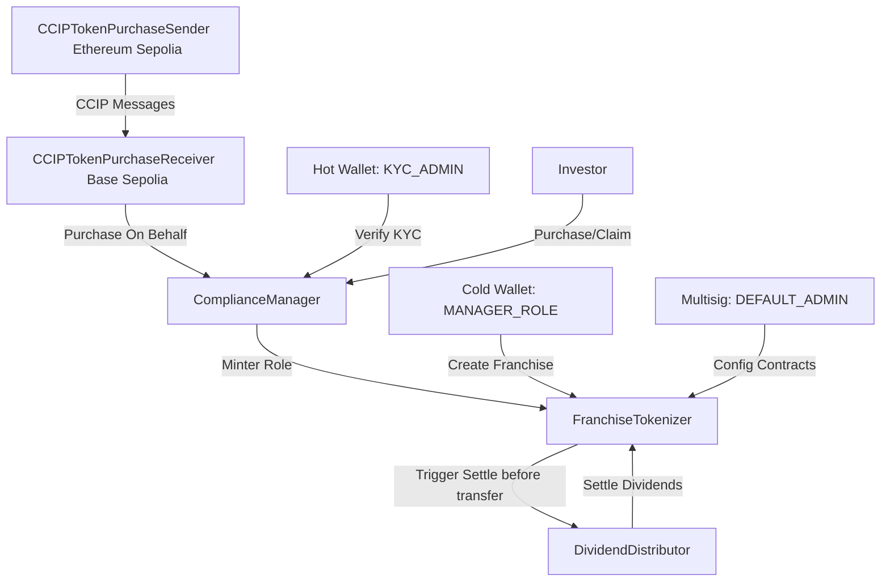

# Manual de Operaciones de Contratos Inteligentes (Cronium MVP)
### Documento de Control Operativo y Gerencial para el Departamento de Administración

> **Versión**: 2.0 — Actualizado tras auditoría de seguridad interna.
> Este manual refleja el estado actual de los contratos desplegados incluyendo todas las mejoras de seguridad aplicadas.

Este manual detalla los procedimientos y responsabilidades del departamento de administración gerencial para la puesta en marcha, gestión del día a día y mitigación de emergencias en la suite de contratos inteligentes de **Cronium**.

---

## 1. Arquitectura General y Flujo de Información

El sistema de contratos de Cronium está compuesto por cinco componentes clave interactuando entre sí para garantizar la tokenización, cumplimiento legal y distribución proporcional de ganancias:



1. **[`FranchiseTokenizer.sol`](file:///c:/Users/hello/Documents/cronium-mvp/contracts/FranchiseTokenizer.sol)**: Contrato principal que representa la propiedad fraccionada de los activos en el mundo real (RWA) mediante tokens estándar ERC1155.
2. **[`ComplianceManager.sol`](file:///c:/Users/hello/Documents/cronium-mvp/contracts/ComplianceManager.sol)**: Responsable del control de cumplimiento legal (KYC). Actúa como intermediario en las compras primarias de tokens.
3. **[`DividendDistributor.sol`](file:///c:/Users/hello/Documents/cronium-mvp/contracts/DividendDistributor.sol)**: Gestiona el depósito de dividendos y su cálculo prorrateado. Se integra con **Chainlink Automation** para la distribución periódica automatizada.
4. **[`CCIPTokenPurchaseSender.sol`](file:///c:/Users/hello/Documents/cronium-mvp/contracts/CCIPTokenPurchaseSender.sol)**: Desplegado en la cadena de origen (ej. Ethereum) para recibir depósitos e iniciar compras cruzadas.
5. **[`CCIPTokenPurchaseReceiver.sol`](file:///c:/Users/hello/Documents/cronium-mvp/contracts/CCIPTokenPurchaseReceiver.sol)**: Desplegado en la cadena destino (Base) para recibir la orden cross-chain y ejecutar la compra utilizando liquidez pre-fondeada.

---

## 2. Puesta en Marcha en Mainnet (Lista de Control Crítica)

Antes de iniciar operaciones comerciales en mainnet, se deben ejecutar los siguientes pasos de configuración en el orden indicado:

### A. Desactivación del "Demo Mode" (¡CRÍTICO!)

El contrato `ComplianceManager` incluye un modo de demostración que **omite por completo la verificación KYC**, permitiendo que cualquier dirección compre tokens sin restricción. **Debe estar desactivado en Mainnet antes de cualquier operación comercial real**.

* **Acción**: Llamar a la función `setDemoMode(false)` utilizando la cuenta con rol `DEFAULT_ADMIN_ROLE`.
* **Verificación**: Consultar la variable pública `demoModeActive()` y confirmar que retorne `false`.
* **Consecuencia si se omite**: Cualquier wallet, incluyendo actores maliciosos, podrá adquirir tokens sin pasar el proceso KYC, violando los requisitos de cumplimiento legal.

### B. Separación y Asignación de Roles (Seguridad de Cuentas)

El despliegue inicial otorga todos los privilegios a la cuenta del desplegador (una sola EOA). Antes de operar en producción se debe realizar la transición al siguiente esquema de seguridad:

| Rol | Asignar a | Justificación |
|-----|-----------|---------------|
| `DEFAULT_ADMIN_ROLE` | **Multisig** (ej. Gnosis Safe, mínimo 3-de-5 firmas) | Controla la configuración global de todos los contratos. La pérdida de esta clave equivale a la pérdida total de control del sistema. |
| `MANAGER_ROLE` | Wallet de operaciones (idealmente multifirma) | Crea y activa franquicias. Un compromiso de esta cuenta podría crear franquicias fraudulentas. |
| `KYC_ADMIN_ROLE` | Hot wallet del equipo de cumplimiento legal | Alta frecuencia de uso. Se recomienda integrar con el sistema de verificación automático de identidad. |

**Procedimiento de transferencia de roles:**
1. Otorgar el rol a la nueva dirección destino con `grantRole(ROLE, newAddress)`.
2. Revocar el rol de la cuenta del desplegador con `revokeRole(ROLE, deployerAddress)`.
3. Verificar que el desplegador ya no posee el rol con `hasRole(ROLE, deployerAddress)`.

> ⚠️ No revocar el `DEFAULT_ADMIN_ROLE` del desplegador hasta confirmar que el Multisig tiene acceso operativo.

### C. Fondeo Inicial de Mensajería CCIP

El contrato emisor en la cadena origen paga tarifas de red en tokens **LINK** por cada transacción cross-chain. El usuario aporta el LINK necesario en el momento de la compra, pero se recomienda mantener un buffer en el contrato.

* **Acción**: Depositar al menos **20 LINK** en el contrato `CCIPTokenPurchaseSender` mediante la función `depositLinkFees(uint256 amount)` para cubrir operaciones iniciales.
* **Monitoreo**: Verificar el balance de LINK periódicamente con `linkToken.balanceOf(senderAddress)`.

### D. Fondeo de Liquidez del Receptor Cross-Chain

El receptor en Base Sepolia ejecuta las compras usando **su propio balance de USDC**. Sin liquidez disponible, todas las compras cross-chain fallarán silenciosamente.

* **Acción**: Depositar USDC mediante la función `depositLiquidity(uint256 amount)`.
* **Restricción de seguridad**: Solo la cuenta propietaria (`onlyOwner`) puede depositar liquidez. Esta restricción fue agregada para prevenir depósitos no autorizados.
* **Regla operativa**: Mantener suficiente liquidez en el receptor para cubrir el volumen esperado de compras cross-chain. Si la liquidez se agota, las compras fallarán con el evento `CrossChainPurchaseFailed`.

### E. Configuración de Chainlink Automation

Para que la distribución de dividendos sea automática:
1. Registrar el contrato `DividendDistributor` en [automation.chain.link](https://automation.chain.link).
2. Configurar el `checkData` con el `franchiseId` codificado en ABI: `abi.encode(franchiseId)`.
3. Registrar un upkeep por cada franquicia activa.
4. Fondear el upkeep con LINK suficiente para cubrir varios ciclos de distribución.

---

## 3. Guía de Operación Diaria (Paso a Paso)

### A. Gestión del Registro KYC (Concesión y Revocación)

El equipo de cumplimiento debe actualizar el estado KYC de los inversores según se validen sus documentos de identidad. El contrato verificará el estado KYC **antes de ejecutar cualquier transferencia de tokens**.

**Estados válidos del sistema KYC:**

| Valor | Estado | Descripción |
|-------|--------|-------------|
| `0` | `None` | Sin solicitud presentada |
| `1` | `Pending` | En proceso de revisión |
| `2` | `Verified` | Aprobado — puede comprar y recibir tokens |
| `3` | `Rejected` | Rechazado — bloqueado del sistema |

#### Registro de un único inversor:
1. Usar la wallet con rol `KYC_ADMIN_ROLE`.
2. Llamar a `setKYCStatus(address user, uint8 status)`.
   * Para aprobar: `status = 2`.
   * Para revocar acceso: `status = 3`.

#### Registro por lotes (Batch KYC — hasta 100 direcciones):
Para optimizar costos de gas durante campañas de marketing o lanzamientos:
1. Llamar a `batchSetKYCStatus(address[] users, uint8 status)` con un array de hasta 100 direcciones.
2. El contrato emitirá el evento `KYCStatusUpdated` por cada dirección procesada.

> **Nota**: Si una dirección intenta recibir tokens sin tener `status = 2` (Verified), la transacción revertirá con el error `"FranchiseTokenizer: Receiver not KYC verified"`. Esta verificación ocurre **antes** de que se modifique cualquier balance.

---

### B. Creación de una Nueva Franquicia (Tokenización)

Cuando se financia un nuevo activo físico en el mundo real y debe tokenizarse:

1. Usar la wallet con rol `MANAGER_ROLE`.
2. Llamar a `createFranchise(string name, string symbol, uint256 totalValue, uint256 maxSupply, address manager)`:

| Parámetro | Descripción | Ejemplo |
|-----------|-------------|---------|
| `name` | Nombre descriptivo de la franquicia | `"Cronium Coffee Monterrey"` |
| `symbol` | Símbolo único del token | `"CR-COF-MTY"` |
| `totalValue` | Valor total en USD con **6 decimales** | `100000000000` (= $100,000 USD) |
| `maxSupply` | Número máximo de tokens emitibles | `1000` |
| `manager` | Dirección del operador físico del negocio | `0xABC...` |

3. El ID de la franquicia se asigna automáticamente de forma incremental (primer proyecto = ID `1`).
4. Se emite el evento `FranchiseCreated` con todos los parámetros para trazabilidad on-chain.

**Restricciones de seguridad en nombre y símbolo:**

El contrato rechazará nombres o símbolos que contengan los siguientes caracteres, ya que podrían alterar el metadato JSON generado on-chain:

| Carácter | Código | Motivo |
|----------|--------|--------|
| `"` | `0x22` | Rompe el formato JSON |
| `\` | `0x5C` | Secuencia de escape JSON |
| `{` | `0x7B` | Abre objeto JSON |
| `}` | `0x7D` | Cierra objeto JSON |
| `:` | `0x3A` | Separador de clave-valor JSON |
| Control chars | `< 0x20` | Caracteres no imprimibles |

Solo se permiten caracteres ASCII imprimibles estándar (rango `0x20` a `0x7E`) excluyendo los anteriores.

**Precio por token** (calculado automáticamente por el sistema):
```
precio_por_token = totalValue / maxSupply
```
Ejemplo: `$100,000 / 1,000 tokens = $100 por token`.

> ⚠️ Si `totalValue` es `0`, el contrato rechazará la creación. Esta validación impide la existencia de franquicias con precio cero que podrían explotarse para adquirir tokens sin costo.

---

### C. Transferencias de Tokens entre Inversores (Secundarias)

Las transferencias secundarias entre wallets verificadas funcionan como cualquier token ERC1155 estándar, con las siguientes restricciones adicionales:

* **KYC del receptor**: El destinatario debe tener `status = 2` (Verified). Si no, la transferencia revierte antes de modificar cualquier balance.
* **Liquidación de dividendos automática**: Antes de cada transferencia, el sistema liquida automáticamente los dividendos pendientes tanto del emisor como del receptor, garantizando que nadie pierda rendimientos acumulados al mover tokens.
* **Límite de batch**: Las transferencias por lote (`safeBatchTransferFrom`) están limitadas a **un máximo de 50 IDs por transacción**. Intentar transferir más de 50 IDs en una sola operación revertirá con `"FranchiseTokenizer: Batch size exceeds maximum of 50"`. Esta restricción protege contra ataques de agotamiento de gas.

---

### D. Distribución y Depósito de Dividendos

Cuando el negocio real genera rendimientos que deben distribuirse a los titulares de tokens:

**Paso 1 — Depósito de fondos:**
1. Calcular el total a distribuir en USDC (ej. $5,000 USDC).
2. Aprobar al contrato `DividendDistributor` para gastar ese monto: `paymentToken.approve(distributorAddress, amount)`.
3. Llamar a `depositDividends(uint256 franchiseId, uint256 amount)`:
   * `amount` en unidades del token (MockUSDC usa **18 decimales** en el entorno de pruebas; USDC real usa **6 decimales**).
   * Ejemplo con MockUSDC de prueba: $5,000 = `5000000000000000000000` (5000 × 10^18).
   * Ejemplo con USDC real de producción: $5,000 = `5000000000` (5000 × 10^6).

**Paso 2 — Ejecución del ciclo:**
* **Automático (Chainlink Automation)**: El sistema detectará el depósito y ejecutará la distribución proporcional cuando transcurra el intervalo configurado (ej. 30 días).
* **Manual (forzado)**: Cualquier dirección puede activar manualmente la distribución llamando a `performUpkeep(bytes performData)` con el `franchiseId` codificado en ABI. Esta función **no requiere permisos especiales** y validará automáticamente las condiciones:
  1. Que haya transcurrido el intervalo mínimo desde el último ciclo.
  2. Que existan fondos en el pool de dividendos pendientes.
  3. Que la franquicia tenga tokens en circulación (supply > 0).

**Protección contra bloqueo de fondos:**
Si el monto depositado es demasiado pequeño en relación al número total de tokens emitidos, el cálculo de pago por token podría resultar en cero. En ese caso, el contrato rechazará la ejecución del ciclo con el mensaje `"DividendDistributor: Dividend per token rounds to zero - increase pool or reduce supply"`. Esto **protege los fondos** de quedar atrapados indefinidamente en el contrato.

**Regla operativa:** Asegurarse de que el monto depositado sea suficiente para distribuir al menos `1 unidad` del token de pago por cada token en circulación.

---

### E. Reclamación de Dividendos por el Inversor

Los inversores pueden reclamar sus dividendos acumulados en cualquier momento:

1. Llamar a `claimDividend(uint256 franchiseId)` desde la wallet del inversor.
2. El contrato liquidará los dividendos pendientes desde el último movimiento de tokens y transferirá el total acumulado al inversor.
3. Se emite el evento `DividendClaimed` con los detalles de la operación.

Para consultar el monto disponible antes de reclamar: `getPendingDividend(address user, uint256 franchiseId)`.

---

### F. Monitoreo y Conciliación de Compras Cross-Chain (CCIP)

El flujo cross-chain requiere seguimiento activo para conciliar los fondos en la cadena origen con los tokens emitidos en la cadena destino.

**Flujo normal:**
1. El inversor aprueba USDC y LINK al contrato `CCIPTokenPurchaseSender` en Ethereum Sepolia.
2. El inversor llama a `sendPurchaseRequest(franchiseId, tokenAmount, paymentAmount)`.
3. El contrato transfiere el USDC y el LINK del usuario, construye el mensaje CCIP y lo envía.
4. Se emite el evento `PurchaseRequestSent` con el `messageId` para trazabilidad.
5. El receptor en Base Sepolia recibe el mensaje, ejecuta la compra y emite `CrossChainPurchaseExecuted`.

**Manejo de transacciones fallidas:**
Si el mensaje llega a la cadena destino pero la compra no puede ejecutarse (KYC incompleto, liquidez insuficiente, etc.):
* El receptor **no revertirá** la transacción de la red para no bloquear la cola de mensajería CCIP.
* Se registrará `purchaseHistory[messageId].success = false` y se emitirá `CrossChainPurchaseFailed`.
* **Resolución**: El administrador debe revisar la causa del fallo, resolver el problema (verificar KYC del inversor o fondear liquidez en el Receiver) y coordinar el minteo manual o el reembolso del depósito retenido en la cadena origen.

**Conciliación de liquidez:**
El USDC depositado por los usuarios en el `CCIPTokenPurchaseSender` (cadena origen) queda retenido en ese contrato. Periódicamente, el propietario debe retirar esos fondos con `emergencyWithdrawPaymentToken(amount)` y rebalancear la liquidez en el `CCIPTokenPurchaseReceiver` (cadena destino) mediante `depositLiquidity(amount)`.

---

## 4. Gestión de Contingencias y Emergencias (Guía del Operador)

### A. Recuperación de Tokens Enviados por Error al DividendDistributor

Si un usuario transfiere tokens no relacionados (ej. LINK, USDT) directamente al contrato `DividendDistributor`:

1. Usar la wallet del propietario (`onlyOwner`).
2. Llamar a `recoverERC20(address tokenAddress, uint256 amount)`.
   * `tokenAddress`: Dirección del token atascado.
   * `amount`: Cantidad a rescatar (en las unidades del token).
3. Los fondos se transferirán directamente a la wallet del propietario.

> 🔒 **Protección integrada**: Esta función rechazará cualquier intento de retirar el token de pago configurado (USDC/MockUSDC). Esto garantiza que las reservas de dividendos de los inversores nunca puedan ser extraídas accidentalmente por esta vía.

---

### B. Retiro de Emergencia en la Cadena Origen (USDC / LINK)

Si hay fondos retenidos en el `CCIPTokenPurchaseSender`:

* **Para retirar LINK acumulado** (fees no utilizados): `withdrawLink(uint256 amount)` — solo propietario.
* **Para retirar USDC** (pagos de usuarios pendientes de rebalanceo): `emergencyWithdrawPaymentToken(uint256 amount)` — solo propietario.

> ⚠️ El USDC retirado representa fondos de usuarios cuyas compras cross-chain aún no fueron completamente conciliadas. Documentar todos los retiros y asegurar la trazabilidad contra los `messageId` correspondientes.

---

### C. Gestión de Liquidez en la Cadena Destino (USDC)

* **Depositar liquidez** (solo propietario): `depositLiquidity(uint256 amount)`.
* **Retirar excedentes** (solo propietario): `withdrawLiquidity(uint256 amount)`.
* **Consultar balance disponible**: `availableLiquidity()` — función de lectura pública.

---

### D. Actualización de Contratos Vinculados (Configuración Crítica)

Si se redespliega algún contrato del sistema (ej. nuevo `ComplianceManager` o nuevo `DividendDistributor`), se deben actualizar las referencias en `FranchiseTokenizer`:

| Función | Rol requerido | Evento emitido |
|---------|---------------|----------------|
| `setComplianceManager(address)` | `DEFAULT_ADMIN_ROLE` | `ComplianceManagerUpdated(previousAddress, newAddress)` |
| `setDividendDistributor(address)` | `DEFAULT_ADMIN_ROLE` | `DividendDistributorUpdated(previousAddress, newAddress)` |

Ambas funciones emiten eventos que permiten auditar on-chain cualquier cambio de configuración. Verificar siempre en el explorador de bloques que el evento fue emitido con los parámetros correctos antes de considerar la actualización completada.

---

### E. Pausado Temporal de Operaciones (Inactivación de Franquicias)

Si se detecta un incidente operativo en un activo físico o una franquicia entra en disputa legal:

1. Usar la cuenta con rol `MANAGER_ROLE`.
2. Llamar a `setFranchiseStatus(uint256 franchiseId, false)` en `FranchiseTokenizer`.
3. Esto bloqueará inmediatamente:
   * Nuevas emisiones de tokens (`mintTokens`).
   * Compras primarias (`purchaseTokens` en ComplianceManager).
4. Las transferencias secundarias entre wallets verificadas **no se bloquean** por este mecanismo.
5. Para reactivar la franquicia: `setFranchiseStatus(uint256 franchiseId, true)`.

---

## 5. Referencia Rápida de Funciones por Rol

### DEFAULT_ADMIN_ROLE
| Función | Contrato | Descripción |
|---------|----------|-------------|
| `setDemoMode(bool)` | ComplianceManager | Activar/desactivar modo demo |
| `setComplianceManager(address)` | FranchiseTokenizer | Actualizar referencia al ComplianceManager |
| `setDividendDistributor(address)` | FranchiseTokenizer | Actualizar referencia al DividendDistributor |
| `grantRole(bytes32, address)` | Ambos | Otorgar roles a nuevas cuentas |
| `revokeRole(bytes32, address)` | Ambos | Revocar roles de cuentas comprometidas |

### MANAGER_ROLE
| Función | Contrato | Descripción |
|---------|----------|-------------|
| `createFranchise(...)` | FranchiseTokenizer | Crear nueva franquicia tokenizada |
| `setFranchiseStatus(uint256, bool)` | FranchiseTokenizer | Activar/pausar una franquicia |

### KYC_ADMIN_ROLE
| Función | Contrato | Descripción |
|---------|----------|-------------|
| `setKYCStatus(address, uint8)` | ComplianceManager | Actualizar KYC de un inversor |
| `batchSetKYCStatus(address[], uint8)` | ComplianceManager | Actualización masiva de KYC (máx. 100) |

### Owner (onlyOwner)
| Función | Contrato | Descripción |
|---------|----------|-------------|
| `depositLiquidity(uint256)` | CCIPTokenPurchaseReceiver | Fondear liquidez cross-chain |
| `withdrawLiquidity(uint256)` | CCIPTokenPurchaseReceiver | Retirar liquidez excedente |
| `withdrawLink(uint256)` | CCIPTokenPurchaseSender | Retirar LINK no utilizado |
| `emergencyWithdrawPaymentToken(uint256)` | CCIPTokenPurchaseSender | Retirar USDC retenido |
| `recoverERC20(address, uint256)` | DividendDistributor | Recuperar tokens enviados por error |
| `setComplianceManager(address)` | CCIPTokenPurchaseReceiver | Actualizar referencia al ComplianceManager |
| `setAllowedSender(uint64, address, bool)` | CCIPTokenPurchaseReceiver | Autorizar/revocar senders CCIP |

---

## 6. Glosario de Variables y Parámetros del Sistema

| Término | Descripción |
|---------|-------------|
| **MockUSDC (pruebas)** | Token ERC20 de prueba con **18 decimales** (estándar de OpenZeppelin). Usado en red local y Sepolia para demostración. |
| **USDC (producción)** | Token ERC20 de Circle con **6 decimales**. Se usará en mainnet para pagos reales. |
| **LINK** | Token de Chainlink para pago de fees CCIP. Usa **18 decimales**. |
| **`address(0)`** | Dirección cero (`0x0000...0000`). Ningún parámetro de configuración debe apuntar a ella, ya que desactiva los controles de seguridad de KYC y dividendos. |
| **`DEFAULT_ADMIN_ROLE`** | Rol más privilegiado del sistema. Puede modificar todos los roles y la configuración global. Debe residir en un Multisig en producción. |
| **`messageId`** | Identificador único de un mensaje CCIP. Usado para rastrear transacciones cross-chain en el explorador de Chainlink. |
| **`franchiseId`** | Identificador numérico único asignado automáticamente a cada franquicia creada. Comienza en `1`. |
| **Ciclo de dividendos** | Periodo entre distribuciones, configurado al momento del despliegue como parámetro inmutable (`interval`). |
| **`perTokenPayout`** | Monto de dividendo por token, almacenado con factor de precisión `10^18` para evitar pérdidas por redondeo en división entera. |
| **Batch limit (50)** | Límite máximo de IDs de token en una operación `safeBatchTransferFrom`. Protección contra ataques de agotamiento de gas. |

---

## 7. Registro de Cambios del Contrato (Changelog)

| Versión | Cambio | Impacto Operativo |
|---------|--------|-------------------|
| v2.0 | KYC verificado **antes** del transfer en `_update` | Elimina ventana de estado inconsistente |
| v2.0 | Límite de **50 IDs** por batch en transferencias | Las operaciones batch deben fragmentarse si superan este límite |
| v2.0 | `performUpkeep` valida condiciones **inline** | Reduce costo de gas; elimina llamada externa a `checkUpkeep` |
| v2.0 | Guard contra `perTokenPayout = 0` en ciclos | Si el pool es muy pequeño, el ciclo no se ejecutará. Aumentar el depósito |
| v2.0 | Validación extendida de caracteres en nombre/símbolo | Los caracteres `"`, `\`, `{`, `}`, `:` y control chars son rechazados |
| v2.0 | `depositLiquidity` restringido a `onlyOwner` | Solo el propietario puede fondear el receptor cross-chain |
| v2.0 | Eventos `ComplianceManagerUpdated` y `DividendDistributorUpdated` | Los cambios de configuración son trazables on-chain |
| v2.0 | `purchaseTokens` cobra exactamente `requiredPayment` | El excedente de `expectedPaymentAmount` no es transferido al treasury |
| v2.0 | `totalValue > 0` obligatorio en `createFranchise` | Imposible crear franquicias con precio cero |
| v2.0 | Aprobación residual revocada tras compra cross-chain | El allowance de USDC al ComplianceManager se pone a cero tras cada compra |
